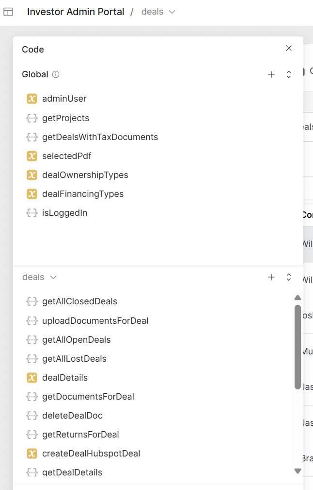
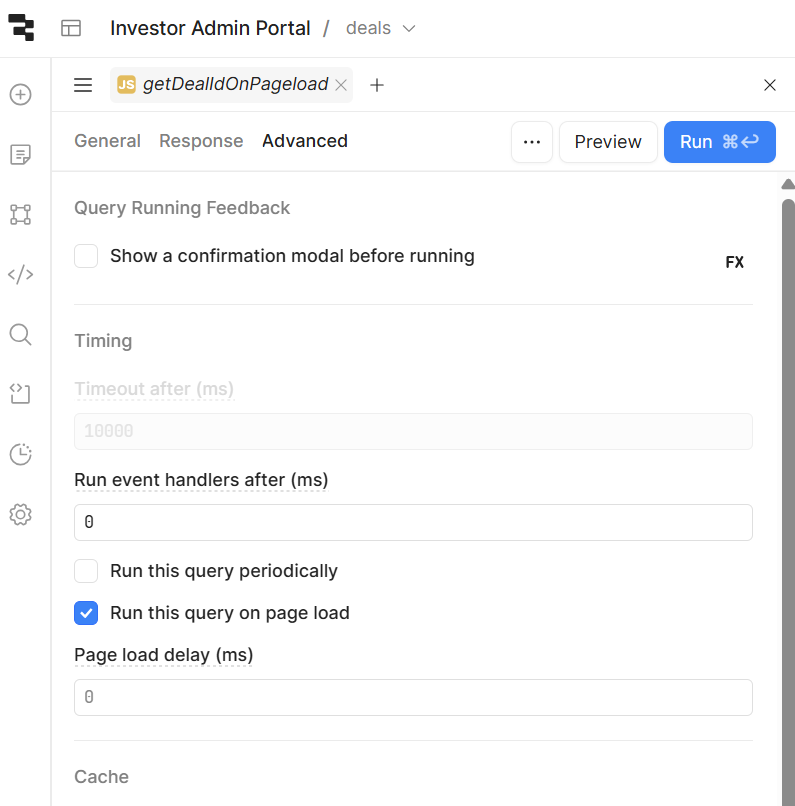

### General Notes on the Admin Portal

#### Pages

The Admin Portal is set up as a Retool multi page application. Each page (deals, users, projects, etc) has its own local scope for variables and routes. For example, the `api/admin/projects` route is only accessible from the `Projects` page.

See the image below for the Deals Page. On the lefthand side, you can see all local (deal page specific) routes (grey) and variables and scripts (yellow)

##### Pageload Events

Most pages have a page scoped script that is configured to run on pageload. The `getDealIdOnPageload` script, see image below, runs on pageload. It inspects the url for the existence of the `id` parameter, and in the case where it is set, triggers the `dealDetails` query for that dealId.  

#### Common Patterns

API requests are typically trigerred `manually`. For example, the pageload scripts trigger the getClosedDeals or getAllUsers requests when their respective page is loaded. Once the data is received by the route, it is usually written to a page specific variable.

When a table row is selected by double clicking, or by clicking on the `View` icon, the request to get details for that deal or user is triggered. the `onSucess` event for the request sets a variable `selectedUser` or `selectedDeal`, and then displays the fullpage deal details modal or user details modal. The components of these modals read the data from the datails variable for that page.
